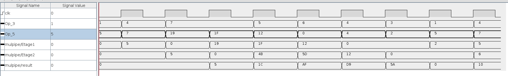

# ARO Laboratoire 3

### Relevez un chronogramme avec les entrées et sorties du bloc multiplieur et les valeurs intermédiaires correspondantes à chacune des 3 étapes.


### Quels sont les largeurs de bus pour chaque étage du circuit ? Pourquoi ?
```
5, 7 et 8 bits respectivement

La première multiplication donne au plus l'opérande 5 bits.

La deuxième multiplication multiplie possiblement par 2 et ajoute donc 1 bit, 
nous ajoutons un 0 à droite pour éviter un overflow lors de l'addition avec le premier étage.

La dernière multiplication peut elle aussi multiplier le résultat précédent et rajoute
donc encore 1 bit en plus.
```